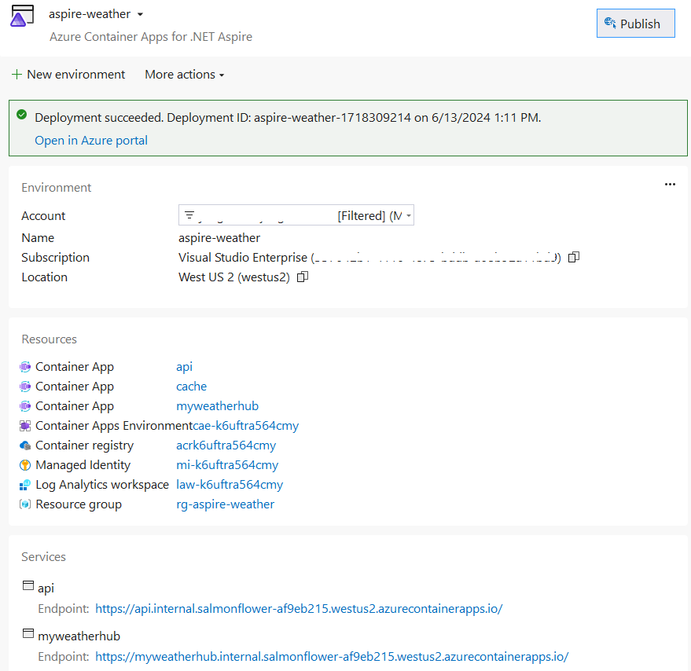

# Azure Container Apps への .NET Aspire アプリのデプロイ

.NET Aspire アプリは、コンテナ化された環境で実行するように設計されています。Azure Container Apps は、サーバーレス プラットフォームでマイクロサービスやコンテナ化されたアプリケーションを実行するための完全に管理された環境を提供します。この記事では、新しい .NET Aspire ソリューションを作成し、Visual Studio と Azure Developer CLI (`azd`) を使用して Microsoft Azure Container Apps にデプロイする手順を説明します。

この例では、前のセクションで作成した MyWeatherHub アプリをデプロイすることを前提としています。自分で構築したコードを使用するか、 **complete** ディレクトリのコードを使用することができます。ただし、手順はどの .NET Aspire アプリでも同じです。

## Visual Studio を使用してアプリをデプロイ

1. ソリューションエクスプローラーで **AppHost** プロジェクトを右クリックし、**Publish** を選択して **Publish** ダイアログを開きます。

  > [!TIP]
  > .NET Aspire の公開には、最新バージョンの `azd` CLI が必要です。これは .NET Aspire ワークロードと一緒にインストールされるはずですが、CLI がインストールされていないもしくは、最新でないという通知が表示された場合は、このチュートリアルの次の部分の指示に従ってインストールできます。

1. 発行対象として **Azure Container Apps for .NET Aspire** を選択します。
    
1. **AzDev Environment** ステップで、希望する **Subscription** と **Location** の値を選択し、**Environment name** に aspire-weather などの名前を入力します。環境名は Azure Container Apps 環境リソースの名前付けを決定します。
1. **Finish** を選択して環境を作成し、**Close** を選択してダイアログ ワークフローを終了し、デプロイメント環境の概要を表示します。
1. **Publish** を選択して、Azure 上のリソースをプロビジョニングしてデプロイします。
    > [!TIP]
    > このプロセスは完了までに数分かかる場合があります。Visual Studio はデプロイメントの進行状況を出力ログで提供し、これらの更新を見ながら公開の仕組みについて多くのことを学ぶことができます。このプロセスには、リソースグループ、Azure Container Registry、Log Analytics ワークスペース、および Azure Container Apps 環境の作成が含まれます。アプリはその後、Azure Container Apps 環境にデプロイされます。

1. 公開が完了すると、Visual Studio は環境画面の下部にリソース URL を表示します。これらのリンクを使用して、デプロイされたさまざまなリソースを表示します。**webfrontend URL** を選択して、デプロイされたアプリをブラウザで開きます。
    

## Azure Developer CLI のインストール

`azd` のインストール手順はオペレーティングシステムによって異なりますが、`winget`、`brew`、`apt`、または直接 `curl` を介して広く利用できます。`azd` をインストールするには、[Azure Developer CLI のインストール](https://learn.microsoft.com/azure/developer/azure-developer-cli/install-azd) を参照してください。

### テンプレートの初期化

1. 新しいターミナルウィンドウを開き、.NET Aspire プロジェクトのルートに `cd` します。
1. `azd init` コマンドを実行してプロジェクトを `azd` で初期化し、ローカルディレクトリ構造を検査してアプリの種類を判断します。

    ```console
    azd init
    ```

    `azd init` コマンドの詳細については、[azd init](https://learn.microsoft.com/azure/developer/azure-developer-cli/reference#azd-init) を参照してください。
1. アプリを初めて初期化する場合、`azd` は環境名を尋ねます。

    ```console
    Initializing an app to run on Azure (azd init)
    
    ? Enter a new environment name: [? for help]
    ```

    続行するために希望する環境名を入力します。`azd` を使用して環境を管理する方法の詳細については、[azd env](https://learn.microsoft.com/azure/developer/azure-developer-cli/reference#azd-env) を参照してください。
1. `azd` が 2 つのアプリ初期化オプションを提示したときに、**現在のディレクトリのコードを使用** を選択します。

    ```console
    ? How do you want to initialize your app?  [Use arrows to move, type to filter]
    > Use code in the current directory
      Select a template
    ```

1. ディレクトリをスキャンした後、`azd` は検出された .NET Aspire AppHost プロジェクトを確認するように求めます。**Confirm and continue initializing my app** オプションを選択します。

    ```console
    Detected services:
    
      .NET (Aspire)
      Detected in: D:\source\repos\letslearn-dotnet-aspire\complete\AppHost\AppHost.csproj
    
    azd will generate the files necessary to host your app on Azure using Azure Container Apps.
    
    ? Select an option  [Use arrows to move, type to filter]
    > Confirm and continue initializing my app
      Cancel and exit
    ```

1. `azd` は、.NET Aspire ソリューション内の各プロジェクトを提示し、どのプロジェクトを HTTP イングレスがパブリックに公開されるようにデプロイするかを尋ねます。API を Azure Container Apps 環境にプライベートに保ち、パブリックに公開しないため、`myweatherhub` のみを選択します (↓ と Space キーを使用します) 。

    ```console
    ? Select an option Confirm and continue initializing my app
    By default, a service can only be reached from inside the Azure Container Apps environment it is running in. Selecting a service here will also allow it to be reached from the Internet.
    ? Select which services to expose to the Internet  [Use arrows to move, space to select, <right> to all, <left> to none, type to filter]
      [ ]  apiservice
    > [x]  myweatherhub
    ```

1. 最後に、プロビジョニングされた Azure リソースの名前付けや `dev` や `prod` などの異なる環境の管理に使用される環境名を指定します。

    ```console
    Generating files to run your app on Azure:
    
      (✓) Done: Generating ./azure.yaml
      (✓) Done: Generating ./next-steps.md
    
    SUCCESS: Your app is ready for the cloud!
    You can provision and deploy your app to Azure by running the azd up command in this directory. For more information on configuring your app, see ./next-steps.md
    ```

`azd` は、作業ディレクトリにいくつかのファイルを生成して配置します。これらのファイルは次のとおりです：

- _azure.yaml_: .NET Aspire AppHost プロジェクトなどのアプリのサービスを説明し、それらを Azure リソースにマッピングします。
- _.azure/config.json_:  azd に現在のアクティブな 環境 を通知する構成ファイル。
- _.azure/aspireazddev/.env_: 環境固有のオーバーライドを含みます。
- _.azure/aspireazddev/config.json_: この環境でパブリック エンドポイントを持つべきサービスを `azd` に通知する構成ファイル。

[.NET Aspire アプリの Azure Container Apps へのデプロイ](https://learn.microsoft.com/dotnet/aspire/deployment/azure/aca-deployment?tabs=visual-studio%2Cinstall-az-windows%2Cpowershell&pivots=azure-azd#deploy-the-app)

### アプリのデプロイ

`azd` が初期化されたら、プロビジョニングとデプロイメントプロセスは単一のコマンド [azd up](https://learn.microsoft.com/azure/developer/azure-developer-cli/reference#azd-up) で実行できます。

```console

By default, a service can only be reached from inside the Azure Container Apps environment it is running in. Selecting a service here will also allow it to be reached from the Internet.
? Select which services to expose to the Internet webfrontend
? Select an Azure Subscription to use:  1. <YOUR SUBSCRIPTION>
? Select an Azure location to use: 1. <YOUR LOCATION>

Packaging services (azd package)


SUCCESS: Your application was packaged for Azure in less than a second.

Provisioning Azure resources (azd provision)
Provisioning Azure resources can take some time.

Subscription: <YOUR SUBSCRIPTION>
Location: <YOUR LOCATION>

  You can view detailed progress in the Azure Portal:
<LINK TO DEPLOYMENT>

  (✓) Done: Resource group: <YOUR RESOURCE GROUP>
  (✓) Done: Container Registry: <ID>
  (✓) Done: Log Analytics workspace: <ID>
  (✓) Done: Container Apps Environment: <ID>
  (✓) Done: Container App: <ID>

SUCCESS: Your application was provisioned in Azure in 1 minute 13 seconds.
You can view the resources created under the resource group <YOUR RESOURCE GROUP> in Azure Portal:
<LINK TO RESOURCE GROUP OVERVIEW>

Deploying services (azd deploy)

  (✓) Done: Deploying service apiservice
  - Endpoint: <YOUR UNIQUE apiservice APP>.azurecontainerapps.io/

  (✓) Done: Deploying service webfrontend
  - Endpoint: <YOUR UNIQUE webfrontend APP>.azurecontainerapps.io/


SUCCESS: Your application was deployed to Azure in 1 minute 39 seconds.
You can view the resources created under the resource group <YOUR RESOURCE GROUP> in Azure Portal:
<LINK TO RESOURCE GROUP OVERVIEW>

SUCCESS: Your up workflow to provision and deploy to Azure completed in 3 minutes 50 seconds.
```

まず、プロジェクトは `azd package` フェーズ中にコンテナにパッケージ化され、次に `azd provision` フェーズでアプリが必要とするすべての Azure リソースがプロビジョニングされます。

`provision` が完了すると、`azd deploy` が行われます。このフェーズでは、プロジェクトはコンテナとして Azure Container Registry インスタンスにプッシュされ、その後コードをホストするために新しい Azure Container Apps のリビジョンが作成されます。

この時点でアプリがデプロイされ構成されており、Azure ポータルを開いてリソースを探索することができます。

## リソースのクリーンアップ

作成した Azure リソースが不要になったときに、次の Azure CLI コマンドを実行してリソースグループを削除します。リソースグループを削除すると、その中に含まれるリソースも削除されます。

```console
az group delete --name <your-resource-group-name>
```